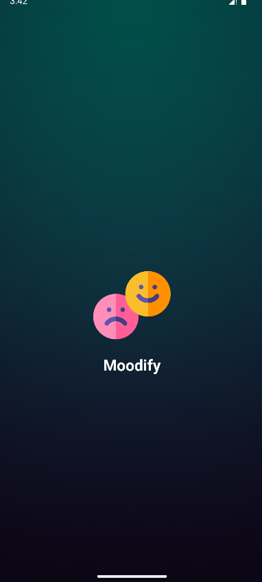
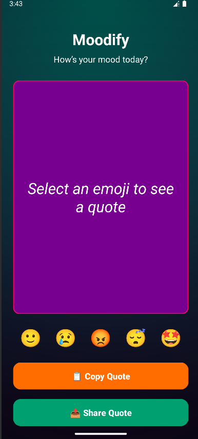
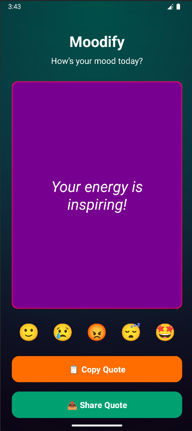

# Moodify – Mood Tracker & Daily Quotes

**Moodify** helps you track your mood every day and gives you motivational quotes based on how you feel. Just tap an emoji and get a random quote tailored to your mood. Copy or share quotes instantly with friends or on social media.

---

## Features

- **Mood-based Quotes:** Select from 5 moods: 🙂 😢 😡 😴 🤩  
- **Random Quote Generator:** Get a different quote every time.  
- **Copy & Share:** Copy the quote to your clipboard or share with friends.  
- **Clean & Full-Screen UI:** Big buttons, large emoji row, stylish quote display.  
- **Easy to Use:** Tap an emoji and instantly see a quote for your mood.  

---

## Screenshots

| Main Screen | Happy Mood Quote | Share Feature |
|-------------|-----------------|---------------|
|  |  |  |

---

## Installation

1. Clone the repository:
   ```bash
   git clone https://github.com/rohan-rusho/Moodify.git
   Open the project in Android Studio.
   Build and run the app on an emulator or physical Android device.
   ```

##Usage

Tap the emoji that represents your current mood.

A random motivational or mood-specific quote will appear.

Tap Copy Quote to copy it to your clipboard.


##Project Structure
Moodify/
├── app/
│   ├── src/main/
│   │   ├── java/com/bcajans/app/satiyorum/MainActivity.java
│   │   ├── res/layout/activity_main.xml
│   │   ├── res/drawable/bg_background.xml
│   │   └── res/drawable/card_bg.xml
├── SS/
│   ├── 1.png
│   ├── 2.png
│   └── 3.png
├── build.gradle
└── README.md

Tap Share Quote to share via messaging apps or social media.
